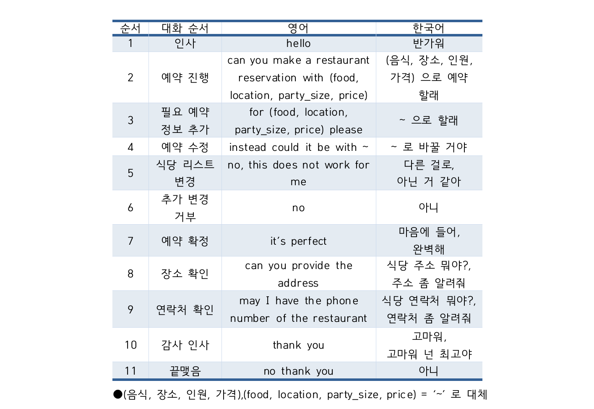
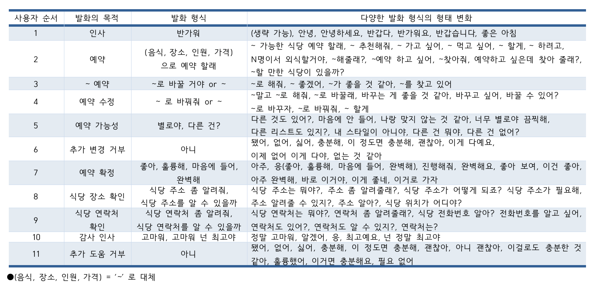
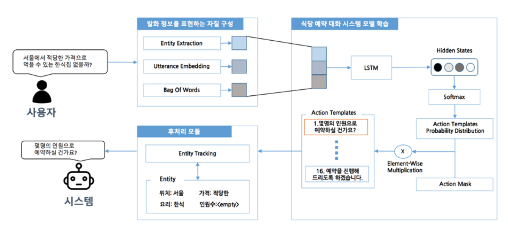
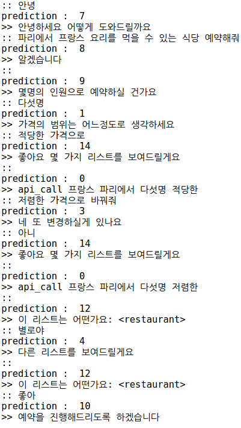
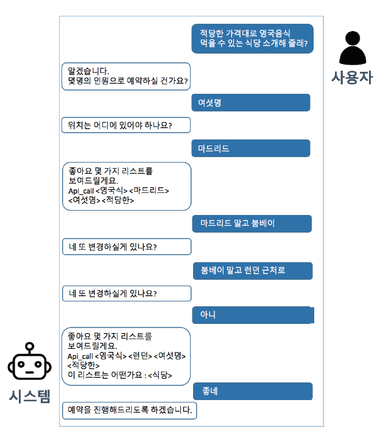
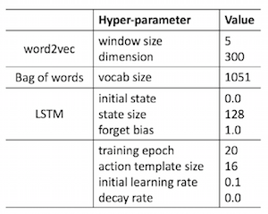
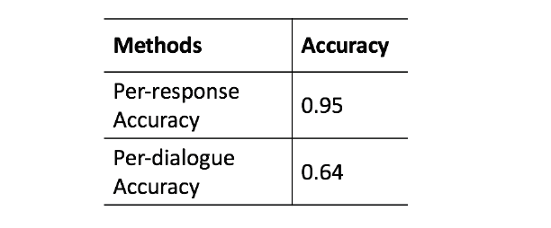

# korean_restaurant_reservation
Implement korean restaurant reservation system based on hybrid code network(https://github.com/johndpope/hcn).
 Add post processing and edit templates to adjust korean dataset which we created. 759 training dialogue data and 190 test dialogue data were used for Korean restaurant reservation dialogue system model.  Experimental results show that the proposed system has 95% accuracy of per-response and 63% accuracy of per-dialogue.
  
## Building Dialogue Data Set
### Restaurant Reservation System Data Translation

### Variation of various speech patterns according to purpose of utterance in Korean

## Proposed Methods

## Interaction

## Result
### Hyper-parameter

### Evaluation

